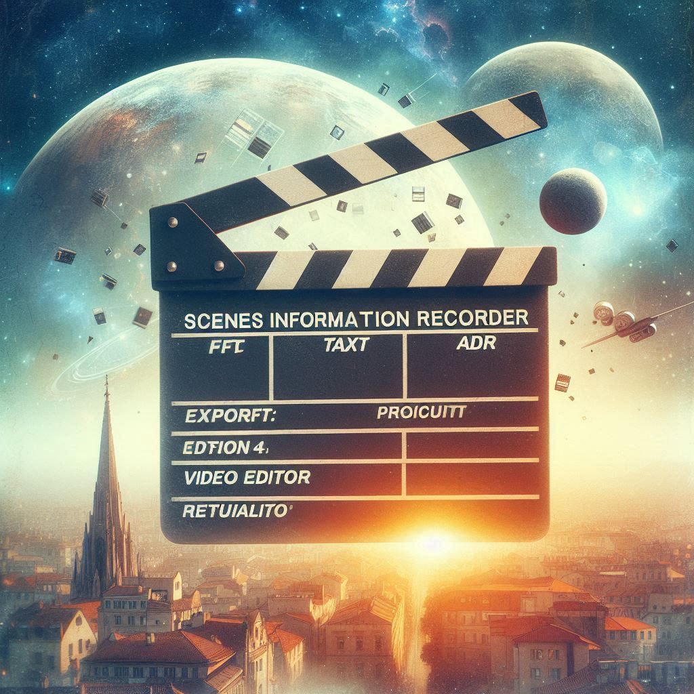
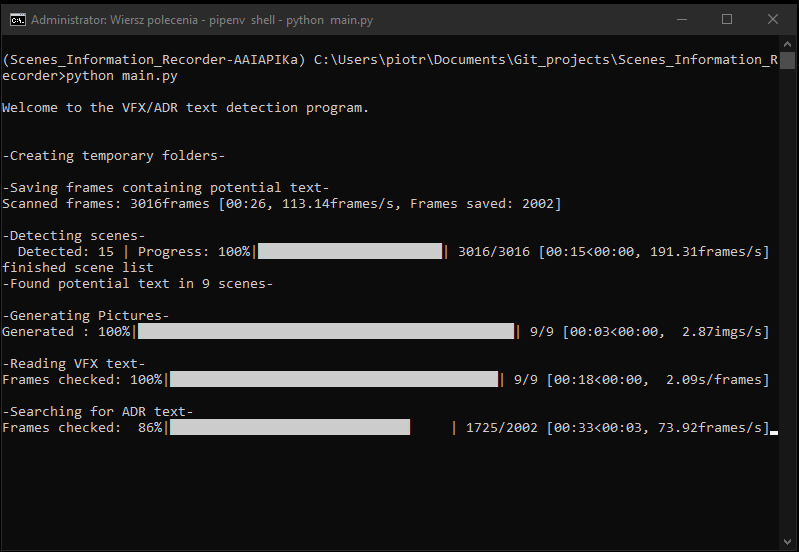
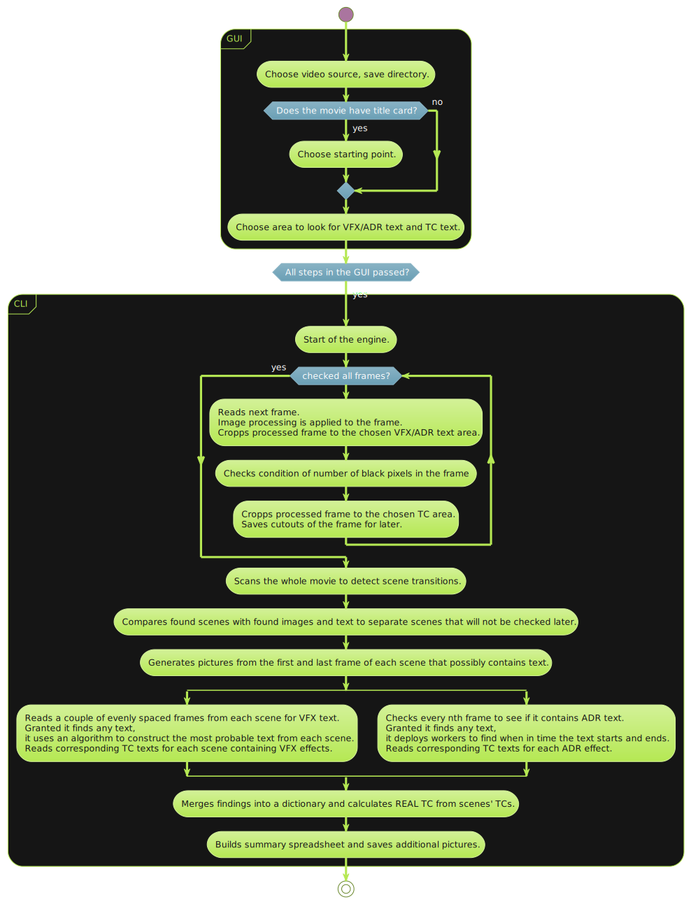

# 
Scenes Information Recorder for Film Editors

  

<strong>Project under development.</strong>

This project is designed to make work easier for film production or post-production editors. The program is intended to read frames from the film and collect relevant information about the scenes, such as:

- Information about the VFX effect to be added to the scene,
- Information about the ADR effect to be added to the scene,
- The time range of the entire scene (from the beginning of the movie) in which the VFX appears,
- Actual time range within the scene (from the beginning of the movie) during which the ADR effect occurs.
- The actual time range of the entire scene in which VFX appears,
- The time range within the scene during which the ADR effect occurs,

After reviewing the entire movie, an Excel file is generated, with a summary of the processed information, and thumbnails of the scenes in which VFX effects occur.

[Getting started](#getting-started) •
[Usage](#usage) •
[Behind the Scenes](#behind-the-scenes) •
[License](#license)

## Installation

---

**1. Clone the repository:**

      git clone https://github.com/PiotrWeppo/Scenes_Information_Recorder.git
      cd Scenes_Information_Recorder

**1. Set up a virtual environment:**

      python -m venv venv

**2. Activate the virtual environment:**

- On Windows:

      .\venv\Scripts\activate

- On macOS and Linux:

      source venv/bin/activate

**3. Install necessary libraries:**

      pip install -r requirements.txt

## Usage

---

The program uses the GUI to help select the initial parameters of the video, such as source and file path, but especially the first frame from which to check the video (some videos may start with a title card, which should be separated from the video being processed) and the areas of text searched by the OCR engine.

      
       Showcasing GUI part of application.
       
       Showcasing CLI part of application.

## Behind the Scenes

---

The graphic below shows a simplified diagram of the program's processes.

  

## License

---

Copyright © 2024 Piotr Weppo

This project is [MIT](https://choosealicense.com/licenses/mit/) licenced.
